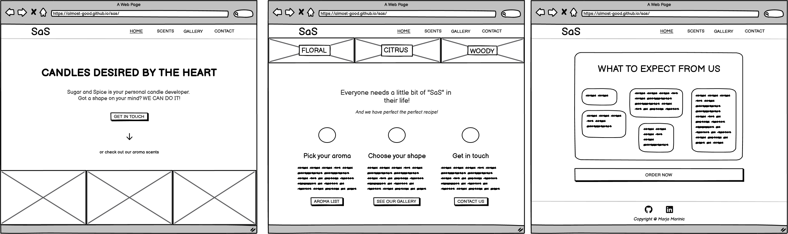

# Sugar and Spice
**Sugar and Spice** is a company that makes custom made-candles, includes its customers in the entire development process and offers a deeply personalized experience. The website is targeted toward people that are interested in the purchase of custom-shaped candles containing specific or random scent mixtures.

Sugar and Spice, or *SaS*, features a "recipe" on how to order a candle, as it is not a modern webshop but takes more traditional approach where, depending on the needs, the customer is presented with the **price quote**.
Users can also view all essential oils available for candle mixtures, a bit of information about them, and the most popular scents which are updated monthly.
Lastly, the site includes a gallery of previous works done, which can be used as inspiration for coming up with new interesting candle shapes.

## **Table of Contents**

- [Developer's Note](#developers-note)
- [UX - User Experience Design](#ux-user-experience-design)
  - [Business Objectives](#business-objectives)
  - [User Stories](#user-stories)
- [Visual Design](#visual-design)
  - [Initial Concept](#initial-concept)
  - [Wireframes](#wireframes)
  - [Colour Scheme](#colour-scheme)
  - [Typography](#typography)
  - [Imagery](#imagery)
- [Features](#features)
  - [Existing Features](#existing-features)
  - [Features Left to Implement](#features-left-to-implement)
- [Testing](#testing)
  - [Devices and Browsers](#devices-and-browsers)
  - [Validators](#validators)
  - [Feature Testing](#feature-testing)
  - [User Story Testing](#user-story-testing)
- [Bugs](#bugs)
- [Technologies Used](#technologies-used)
  - [Languages](#languages)
  - [Tools](#tools)
  - [For Testing](#for-testing)
- [Deployment](#deployment)
- [Credits](#credits)

## **Developer's Note**
Sugar and Spice project is created as a **Portfolio Project** for Code Institute Full Stack Software Developer program. 
The project showcases my skills in HTML and CSS, which I acquired as a Code Institute student.

Please **note:** This website is purely fictional, and the company in question does not exist. Although I enjoy candles myself, I am in no way an expert, *so I would advise against using this site as a primary reference for candle-related information*.

Back to [Table of Contents](#table-of-contents)

## **UX, User Experience Design**

### **Business Objectives**
As the business:
1. We want to attract customers with our modern design.
2. We want an accessible website for any of our potential customers.
3. We want to clarify what the customer can expect from us. 
4. We want to help the customer find the perfect scent for them by providing them with information about the different scents we offer.
5. We want to show the customer portfolio of our previous work.
6. We want to make the ordering process simple for the customer.
7. We want to get an order from the customer.

### **User Stories**
As a user:
1. I want to have a clear sense of what the site is about.
2. I want to be able to easily navigate the site and in an intuitive way.
3. I want to interact with a page in a way that I am already accustomed to.
4. I want to be able to view the site on a device of my choosing.
5. I want to know what I should do to do to order a candle.
6. I want to know what kind of product I can expect.
7. I want to check out what kind of candle scents they are currently offering.
8. I want to check out which scents are most popular.
9. I want to educate myself in regard to different scents and see what they are about.
10. I want to see what kind of candles they have already done.
11. I want to be able to contact site owners so I can get more information or make an order.

Back to [Table of Contents](#table-of-contents)

## **Visual Design**

### **Initial Concept**

### **Wireframes**
Wireframes are created using Balsamiq for organizational purposes.
  
  

  

You can find all wireframes here:
- **Desktop View**
  - [Home](assets/docs/wireframes/home-desktop.png)
  - [Scents Page](assets/docs/wireframes/scents-desktop.png)
  - [Gallery Page](assets/docs/wireframes/gallery-desktop.png)
  - [Contact Page](assets/docs/wireframes/contact-desktop.png)
- **Tablet View**
  - [Home](assets/docs/wireframes/home-tablet.png)
  - [Scents Page](assets/docs/wireframes/scents-tablet.png)
  - [Gallery Page](assets/docs/wireframes/gallery-tablet.png)
  - [Contact Page](assets/docs/wireframes/contact-tablet.png)
- **Mobile View**
  - [Home](assets/docs/wireframes/home-mobile.png)
  - [Scents Page](assets/docs/wireframes/scents-mobile.png)
  - [Gallery Page](assets/docs/wireframes/gallery-mobile.png)
  - [Contact Page](assets/docs/wireframes/contact-mobile.png)
  - [Navigation](assets/docs/wireframes/navigation-mobile.png)
### **Colour Scheme**

### **Typography**

### **Imagery**
Back to [Table of Contents](#table-of-contents)

## **Features**

### **Existing Features**

### **Features Left to Implement**
- **Features shared between all pages:**
  - **Navigation**
    - Fully responsive navigation bar placed horizontally for desktop and tablet devices. For a mobile view, the navigation links are accessed through a hamburger menu in the vertical direction.
    - The navigation bar is in a fixed position, always visible to the user, ensuring easy access to different parts of a site.
    - The navigation bar features Sugar and Spice logo and navigational links.
    - Navigational links direct customers to:
      - Home page
      - Scents page
      - Gallery page
      - Contact page
  - **Footer**
    - SaS dedicated footer to their developer, aka me.
    - Footer is placed at the bottom of the site and includes Copyrights and the developer's social media links, GitHub and LinkedIn.
- **Home Page**
  - **Header**
    - Header contains the title of the page together with two different calls to action.
    - 1st CTA is targeted towards the site's main function which is the sale of the product. The user is able to get in touch with SaS experts and order a candle.
    - 2nd CTA links to the Scents page, so the user can check out the different essential oils we are using in our blends. 
    - Header is designed so the user can immediately order products or continue exploring the site.
  - **Aroma List Section**
    - The Aroma List Section includes three stunning images of the different aroma types available on website.
    - This section shows users what types of fragrance we have available and it invites them to read more about each one.
  - **Order Recipe Section**
    - Order Recipe Section contains step-by-step instructions on how to order a product. Each step opens the door to more exploration, with the last inviting the user to purchase the product.
    - This section is very important because it prompts the user to investigate what would be best for them so that we can make an outstanding product for them.
  - **Expectation Section**
    - This section lists product and delivery information, service expectation etc. 
    - This is valuable information for the user and will help them to decide if the SaS products fit their needs.
    - The end of this section features the final call-to-action, redirecting the user to the contact page to purchase the product.
- **Scents Page**
  - **Top Picks Section**
    - Top Picks Section showcases the most popular scents from each group of fragrances. This section is updated every month.
    - It's constructed as a grid of images with a different layout for mobile, tablet and desktop devices. Each group has its own specific background and each grid item has its name displayed, enabling the user to differentiate between different aromas. 
    - Grid items have two different states.
      - During the first state, they display part of the background image of the group, with their respectable name on top of it.
      - Second state, the focused one, displays an image of the essential oil source with few of its traits.
  - **Something More Section**
    - The Something More Section is an introductionary section with the purpose of prompting the user to read the list containing all the available fragrances.
  - **Aroma Types Section**
    - The Aroma Types Section contains four different aroma types, with their general descriptions and traits, together with an extensive list of every fragrance available to choose from. 
    - All aroma types are interlinked, allowing for easy navigation between them.
- **Gallery Page**
  - Gallery Page is used for showcasing the previous work done by the Sugar and Spice company. 
  - Images follow a specific layout, so the final look is coherent. 
  - Mobile layout has been adjusted so the images can remain visible on smaller devices. 
- **Contact Page**
  - Contact Page is the final page of the site. It enables users to get in touch with our experts, whether they seek more information regarding the products or wish to buy them.
  - Contact Page features a standard contact form, including the name, email and content fields. 

Back to [Table of Contents](#table-of-contents)

## **Testing**

### **Devices and Browsers**

### **Validators**

### **Feature Testing**

### **User Story Testing**
Back to [Table of Contents](#table-of-contents)

## **Bugs**
Back to [Table of Contents](#table-of-contents)

## **Technologies Used**

### **Languages**

### **Tools**

### **For Testing**
Back to [Table of Contents](#table-of-contents)

## **Deployment**
Back to [Table of Contents](#table-of-contents)

## **Credits**
Back to [Table of Contents](#table-of-contents)